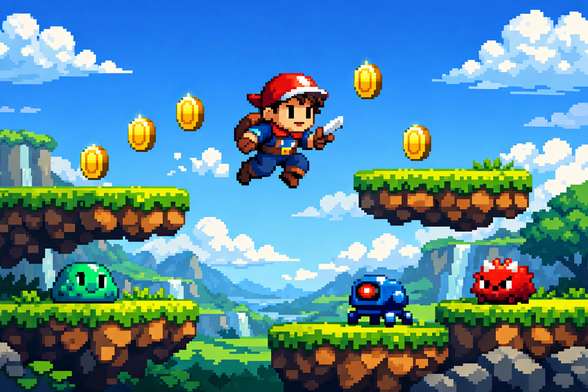

# 🎮 First-Game-Godot: A Professional 2D Platformer

<!-- Project Banner/Screenshot -->
<p align="center">
  
</p>

[](https://godotengine.org/)
[](LICENSE)
[](https://github.com/Mohamed-Elsayed970/Game)

---

## 🌟 Overview

This project serves as a **professional starting point** for 2D game development using the **Godot Engine 4.x**. It is designed with a clean, modular architecture, focusing on best programming practices to ensure easy scalability and maintenance. It is not just a game; it is a **complete template** that developers can build upon to create their own unique projects.

## ✨ Key Features

The project is built on a solid foundation of essential platformer features:

*   **Responsive Controls:** Smooth and precise character movement, including running, jumping, and double jump mechanics.
*   **Scene Management:** Utilizes the **Composition over Inheritance** principle in Godot, separating entities (Player, Enemies, Collectibles) into reusable, independent scenes.
*   **Asset Organization:** Meticulous organization of graphical and audio resources within the `assets/` folder for easy access and modification.
*   **Integrated Audio System:** Includes sound effects (SFX) for movement, jumping, and coin collection, alongside background music (BGM).

## ⚙️ Technical Stack

| Component | Technology | Description |
| :--- | :--- | :--- |
| **Engine** | Godot Engine 4.x | The main open-source game engine used. |
| **Language** | GDScript | Godot's lightweight and optimized scripting language. |
| **Graphics** | Pixel Art | Utilizes a classic pixel art style for visual appeal. |
| **License** | MIT License | An open-source license allowing commercial use. |

## 📂 Project Architecture

The project structure reflects Godot development best practices:

| Folder/File | Purpose | Professional Notes |
| :--- | :--- | :--- |
| `project.godot` | Main Configuration File | Contains project settings, input maps, and the default scene. |
| `assets/` | Assets and Resources | **Must** contain all fonts, sounds, and graphics. |
| `scenes/` | Game Scenes (.tscn) | Reusable scenes like `player.tscn` and `coin.tscn`. |
| `scripts/` | Game Logic (.gd) | All GDScript files, separated from scenes for clarity. |
| `LICENSE` | Project License | Defines user and developer rights. |
| `README.md` | Project Documentation | The file you are currently reading. |

## 🗺️ Project Roadmap

The development of this project follows a structured roadmap to ensure continuous improvement and feature expansion.

| Status | Feature | Description |
| :--- | :--- | :--- |
| ✅ Done | Core Player Movement | Basic run, jump, and double jump mechanics implemented. |
| ✅ Done | Collectibles (Coins) | Coin scene and collection logic with sound effects. |
| ✅ Done | Basic Level Design | Initial scene setup with platforms and kill zones. |
| 🚧 In Progress | Enemy AI | Implementing basic patrol and chase behavior for enemies. |
| 💡 Planned | UI/HUD System | Score display, health bar, and pause menu. |
| 💡 Planned | Multiple Levels | Expanding the game with 3-5 unique levels. |

## 🚀 Getting Started

To run and develop this project, follow these steps:

### Prerequisites

Ensure you have **Godot Engine 4.x** or later installed.

### Installation

1.  **Clone the Repository:**
    ```bash
    git clone https://github.com/Mohamed-Elsayed970/Game.git
    ```
2.  **Navigate to the Directory:**
    ```bash
    cd Game
    ```
3.  **Open the Project:**
    *   Open the Godot Engine.
    *   Click **Import** and select the `project.godot` file inside the directory.
    *   Click **Import & Edit**.

### Running the Game

Once the project is open in the editor, press the **Play** button (or **F5**) to start the game.

## 🤝 Contributing

We welcome any contributions to improve this template! If you have suggestions or find bugs, please:
1.  Open an **Issue** to describe the problem or proposed feature.
2.  Create a **Pull Request** with your suggested changes.

## 📄 License

This project is licensed under the **MIT License**. See the [LICENSE](LICENSE) file for more details.
