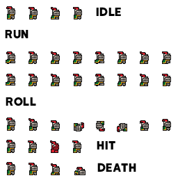

# 🎮 First-Game-Godot: A Professional 2D Platformer

<!-- Placeholder for Project Banner/Screenshot -->
<p align="center">
  
</p>

[](https://godotengine.org/)
[](LICENSE)
[](https://github.com/Mohamed-Elsayed970/Game)

---

## 🌟 Overview

هذا المشروع يمثل **نقطة انطلاق احترافية** في تطوير الألعاب ثنائية الأبعاد باستخدام محرك **Godot Engine 4.x**. تم تصميم المشروع بهيكلة معيارية ونظيفة، مع التركيز على أفضل الممارسات البرمجية لضمان سهولة التوسع والصيانة. إنه ليس مجرد لعبة، بل هو **قالب متكامل** يمكن للمطورين البناء عليه لإنشاء مشاريعهم الخاصة.

## ✨ Key Features

تم بناء المشروع على أساس متين من الميزات الأساسية لألعاب المنصات:

*   **نظام تحكم متجاوب (Responsive Controls):** حركة شخصية دقيقة وسلسة، تشمل الجري، القفز، والقفز المزدوج (Double Jump).
*   **إدارة المشاهد (Scene Management):** استخدام مبدأ **Composition over Inheritance** في Godot، حيث يتم فصل الكيانات (مثل اللاعب، الأعداء، العملات) إلى مشاهد مستقلة قابلة لإعادة الاستخدام.
*   **هيكلة الأصول (Asset Organization):** تنظيم دقيق للموارد الرسومية والصوتية داخل مجلد `assets/` لسهولة الوصول والتعديل.
*   **نظام صوتي متكامل:** دمج مؤثرات صوتية (SFX) للمس، القفز، وجمع العملات، بالإضافة إلى موسيقى خلفية (BGM).

## ⚙️ Technical Stack

| المكون | التقنية | الوصف |
| :--- | :--- | :--- |
| **المحرك** | Godot Engine 4.x | محرك الألعاب الرئيسي مفتوح المصدر. |
| **لغة البرمجة** | GDScript | لغة برمجة Godot الخفيفة والمُحسّنة. |
| **الرسوميات** | Pixel Art | استخدام فن البكسل لأسلوب بصري كلاسيكي. |
| **الترخيص** | MIT License | ترخيص مفتوح المصدر يسمح بالاستخدام التجاري. |

## 📂 Project Architecture

تم تنظيم المشروع ليعكس أفضل الممارسات في تطوير Godot:

| المجلد/الملف | الغرض | ملاحظات احترافية |
| :--- | :--- | :--- |
| `project.godot` | ملف الإعداد الرئيسي | يحتوي على إعدادات المشروع، الإدخالات، والمشهد الافتراضي. |
| `assets/` | الأصول والموارد | **يجب** أن يحتوي على جميع الخطوط، الأصوات، والرسوميات. |
| `scenes/` | مشاهد اللعبة (.tscn) | مشاهد قابلة لإعادة الاستخدام مثل `player.tscn` و `coin.tscn`. |
| `scripts/` | منطق اللعبة (.gd) | جميع ملفات GDScript، مفصولة عن المشاهد لزيادة الوضوح. |
| `LICENSE` | ترخيص المشروع | يحدد حقوق المستخدمين والمطورين. |
| `README.md` | وثائق المشروع | هذا الملف الذي تقرأه. |

## 🚀 Getting Started

للبدء في تشغيل وتطوير المشروع، اتبع الخطوات التالية:

### Prerequisites

تأكد من تثبيت **Godot Engine 4.x** أو أحدث.

### Installation

1.  **استنساخ المستودع (Clone the Repository):**
    ```bash
    git clone https://github.com/Mohamed-Elsayed970/Game.git
    ```
2.  **الدخول إلى المجلد:**
    ```bash
    cd Game
    ```
3.  **فتح المشروع:**
    *   افتح محرك Godot.
    *   انقر على **Import** واختر ملف `project.godot` داخل المجلد.
    *   انقر على **Import & Edit**.

### Running the Game

بمجرد فتح المشروع في المحرر، اضغط على زر **Play** (أو **F5**) لتشغيل اللعبة.

## 🗺️ Project Roadmap

The development of this project follows a structured roadmap to ensure continuous improvement and feature expansion.

| Status | Feature | Description |
| :--- | :--- | :--- |
| ✅ Done | Core Player Movement | Basic run, jump, and double jump mechanics implemented. |
| ✅ Done | Collectibles (Coins) | Coin scene and collection logic with sound effects. |
| ✅ Done | Basic Level Design | Initial scene setup with platforms and kill zones. |
| 🚧 In Progress | Enemy AI | Implementing basic patrol and chase behavior for enemies. |
| 💡 Planned | UI/HUD System | Score display, health bar, and pause menu. |
| 💡 Planned | Multiple Levels | Expanding the game with 3-5 unique levels. |

## 🤝 Contributing

نرحب بأي مساهمات لتحسين هذا القالب! إذا كان لديك اقتراحات أو وجدت أخطاء، يرجى:
1.  فتح **Issue** لوصف المشكلة أو الميزة المقترحة.
2.  إنشاء **Pull Request** مع التغييرات المقترحة.

## 📄 License

هذا المشروع مرخص بموجب **ترخيص MIT**. انظر ملف [LICENSE](LICENSE) لمزيد من التفاصيل.
